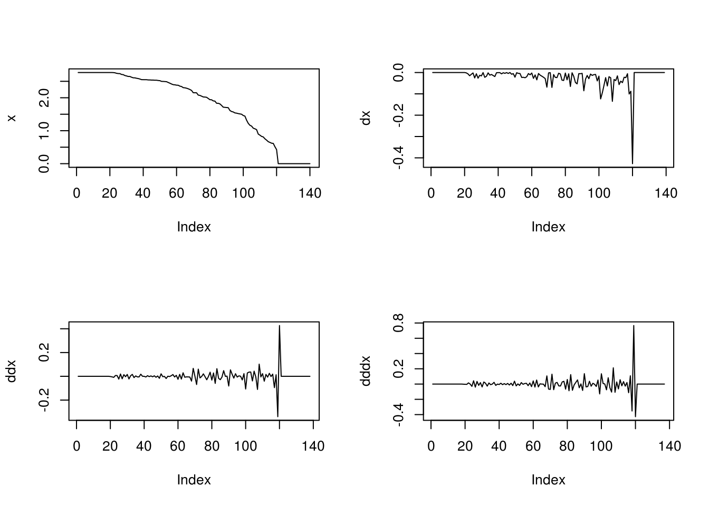
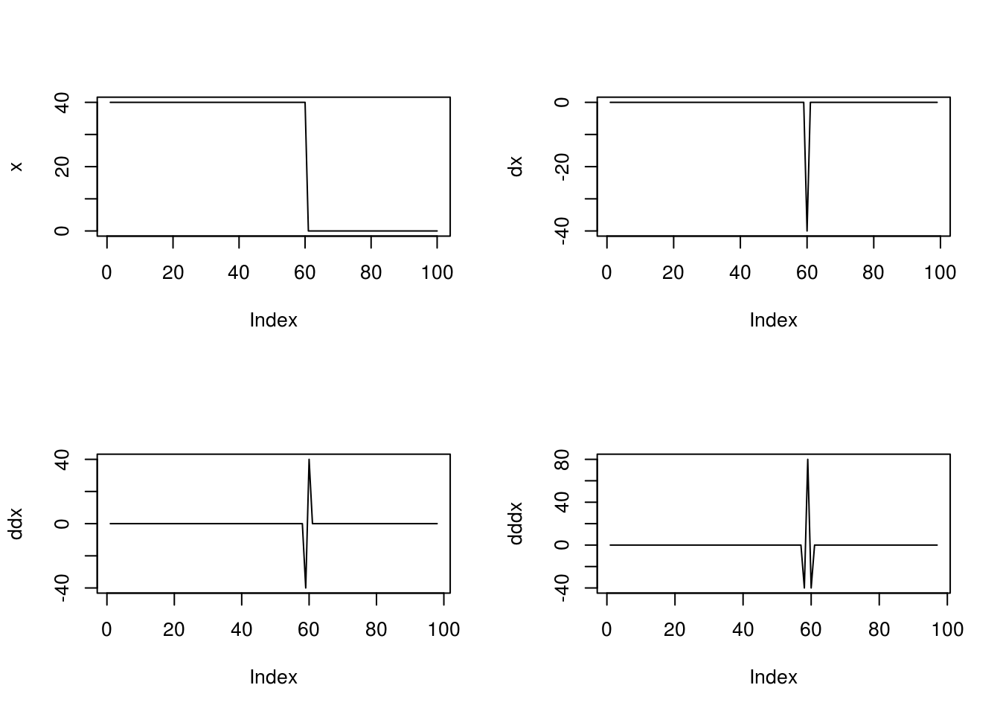
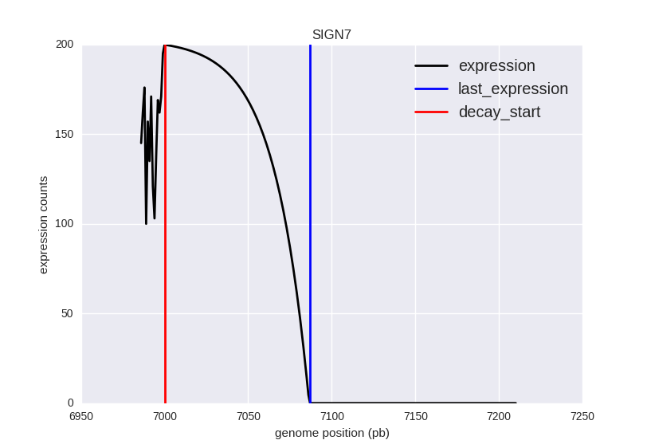
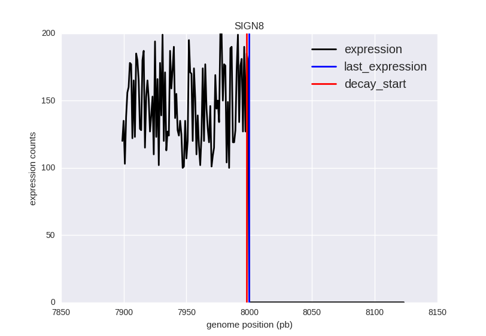

# Diffraction

This project is part of my master thesis (MSc in Bioinformatics) and a project of the Centre for Genomic Regulation (CRG). Check the [LICENSE](./LICENSE) if you plan to use content of this repository.

## Goal

Diffraction includes several function to work and perform differential analysis over pile ups coming from non fractionated RNASeq analysis.

At the moment, we have the following functions:

 - [*_finddrops_*](#finddrops) : detect drops in the expression profile
 - [*_create_toyset_*](#create_toyset) : generates a set of annotation, fasta genome and expression file with known features

## finddrops

This script looks for drops in the expression using the following algorithm:

1. _finddrops_ accepts a two columns files ([position, expression])
2. It takes the expression profile and an annotation file to compute the average distance between annotations.
3. It works with sliding windows composed by a expression window (100 by default) and a no\_exp\_window (average distance between annotations/4)
4. The drop will only be considered if:
  - Window of expression does not include any 0.0 and the last nucleotide is greater than 0.0
  - Window of no expression has an average smaller than a threshold of expression (0.0 by default)
5. The outcome is a dictionary including: \{identifier:\[window start, window end, last position with expression, stdsc, maxsc, dropsc\]\}
  - As you can notice we see three different scores: stdsc, maxsc and dropsc:
    - stdsc is the standard deviation of the expression window
    - maxsc is the maximum difference between contiguous positions
    - dropsc is the first derivative between the last position and the first nucleotide in the no expression window
  - Additionally we have two positional values:
    - decay start represents the decay start that marks the first nucleotide after which the expression profiles starts to decay with the factor
    - last position with expression

The interpretation for this values is:

  - high stdsc, low maxsc and maxsc != dropsc ==> decay position: The change in expression decays gradually but with no big changes, this hardens the match between maximum change (minimum derivative) and the drop in the last position with expression
  - low stdsc, high maxsc and maxsc == dropsc ==> sharp position: The change in expression is abrupt and with a big difference, this makes easier the match between minimum derivative and the index position.

Additionally, if the termination is sharp, the decay start will match the last expression base, thing that will not occur if the termination is in decay.

The goal is to have a simple rule to discriminate between:

**Decay drop**

**Sharp drop**

The example of two toy examples:

**Decay drop**

It returns the following figure:

And this result in the dictionary:

  > 'SIGN7': [6986, 7211, 7000, 7087, 48.701261488320782, -76.0, -4.6440034020500001]

**Sharp drop**

And this result in the dictionary:

  > 'SIGN8': [7899, 8124, 7998, 8000, 29.395014138295107, -179.0, -179.0]

## create\_toyset

Very basic script to generate a toy set of annotation, expression and fasta genome with known features.
